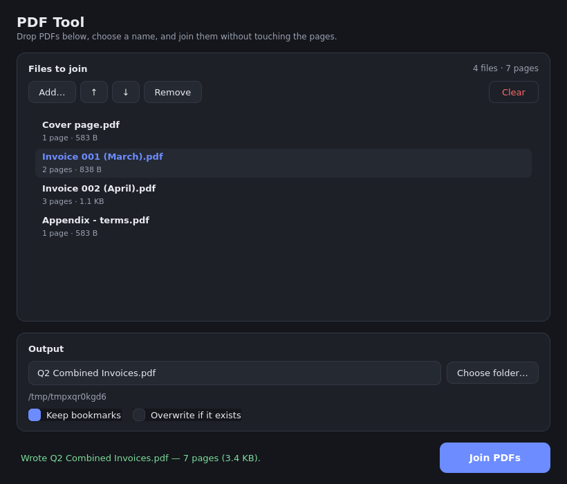

# PDF_tool

Small, predictable utilities for working with PDF files, written in Python.

The first tool joins two or more PDF files into one. Pages are copied
**in the order you give them** and **you choose the output file's name**.

```console
$ pdf-join part-one.pdf part-two.pdf part-three.pdf --output "Annual Report.pdf"
Joining 3 PDF file(s):
  1. part-one.pdf (3 page(s))
  2. part-two.pdf (2 page(s))
  3. part-three.pdf (1 page(s))
Wrote Annual Report.pdf (6 page(s), 2.2 KB)
```

## Install

Python 3.9 or newer is required (developed and tested on 3.11). The only
runtime dependency is [`pypdf`](https://pypi.org/project/pypdf/).

```bash
python3 -m venv .venv
source .venv/bin/activate
pip install -e .          # installs the pdf-join command
pip install -e ".[gui]"   # also installs PySide6 for the desktop app
```

Just want the library? `pip install -r requirements.txt` and
`import pdf_tool`.

## Usage

```
pdf-join INPUT [INPUT ...] -o NAME [-f] [--no-bookmarks] [-q]
```

| Argument | Meaning |
| --- | --- |
| `INPUT ...` | Two or more PDF files, joined in the order given. |
| `-o, --output NAME` | Name of the combined PDF. Required. |
| `-f, --overwrite` | Replace `NAME` if it already exists. |
| `--no-bookmarks` | Do not copy bookmarks from the inputs. |
| `-q, --quiet` | Only report errors. |
| `--version` | Print the version and exit. |

More examples:

```bash
pdf-join chapter*.pdf --output book.pdf     # shell expands the wildcard
pdf-join a.pdf b.pdf -o out/all.pdf         # parent folders are created
pdf-join a.pdf b.pdf -o report              # becomes report.pdf (you are told)
python -m pdf_tool a.pdf b.pdf -o c.pdf     # no install needed
```

## What "without making any edits" means

The join is a page-level copy: every page of every input is cloned into a new
document. Concretely, for each output page compared with its source page:

* the **content stream bytes are identical** — nothing is re-rendered,
  re-typeset, rasterised or re-flowed;
* **page size and rotation are untouched** (the `/MediaBox` is copied, so a
  letter page next to an A4 page stays letter next to A4);
* **resources are copied as-is**, including fonts and embedded images — image
  data is not recompressed;
* **input files are never modified**, and the output is written to a temporary
  file and renamed into place, so a failure can never leave a half-written
  PDF at your output path.

The test suite checks each of these claims directly, by comparing bytes before
and after a join.

### Deliberate guards

* Fewer than two inputs is an error rather than a copy.
* An existing output file is never replaced unless you pass `--overwrite`.
* The output name may not be one of the inputs (that would destroy a source).
* Inputs that are missing, not PDFs, or password protected produce a one-line
  message and exit code 1 — never a traceback.

## Library use

```python
from pdf_tool import join_pdfs

result = join_pdfs(["a.pdf", "b.pdf"], "combined.pdf", overwrite=True)

print(result.total_pages)              # pages in the output
print([(f.path, f.pages) for f in result.files])
print(result.output, result.size_bytes)
```

Errors derive from `pdf_tool.PdfToolError`: `NotEnoughInputsError`,
`InputNotFoundError`, `InvalidPdfError`, `EncryptedPdfError`,
`OutputExistsError`, `OutputConflictError`.

## Desktop GUI (PySide6)

A modern dark-themed desktop app ships with the `[gui]` extra. Run it with
`pdf-join-gui` (or `python -m pdf_tool.gui`, optionally passing PDFs as
arguments).

<p align="center">
  
</p>

It uses the same `join_pdfs` library function as the CLI, so behaviour and
guarantees are identical. You can drag PDFs in from the file manager, reorder
them, see live page counts and sizes, name the output, choose a folder, and
toggle "keep bookmarks" / "overwrite". Joining runs on a background thread, so
the window never freezes.

The GUI is optional: `pdf-join` does not import Qt at all.

## Continuous integration & releases

* **`.github/workflows/ci.yml`** runs pyflakes and the full pytest suite on
  Linux / Windows / macOS across Python 3.9–3.13. GUI tests run headless with
  `QT_QPA_PLATFORM=offscreen` (Linux installs the Qt runtime libs it needs; on
  any host where Qt cannot load, those tests skip and the CLI tests still run).
* **`.github/workflows/release.yml`** fires on `v*` tags. It builds an sdist +
  wheel (published to PyPI via trusted publishing) and produces single-file
  executables — `pdf-join` and `pdf-join-gui` — on Windows, macOS and Linux,
  then attaches everything to a GitHub release.
* The exe build goes through a Python build script,
  [`packaging/build_exe.py`](packaging/build_exe.py): it drives PyInstaller
  from [`packaging/pdf-tool.spec`](packaging/pdf-tool.spec) and, on Windows,
  compiles the Inno Setup installer
  ([`packaging/installer.iss`](packaging/installer.iss)) to a
  `PDFTool-Setup-<version>.exe` (with Start-Menu/desktop shortcuts and the app
  dir added to the user's `PATH` so `pdf-join` works from a prompt). CI installs
  Inno Setup with Chocolatey on the Windows runner.

To enable PyPI publishing, register this repo + workflow as a *trusted
publisher* on pypi.org; until then that step fails harmlessly while the GitHub
release is still produced.

## Development

```bash
pip install -e ".[dev]"
python -m pytest
```

The tests build their own fixture PDFs byte by byte
([`tests/factories.py`](tests/factories.py)), so no PDF generator is needed and
the fixtures can be inspected exactly.

GUI tests are headless: set `QT_QPA_PLATFORM=offscreen`. On a bare Linux
machine Qt also needs its runtime libraries (e.g. `libegl1 libgl1
libxkbcommon0 libdbus-1-3`); CI installs them automatically. Where Qt cannot
load, the GUI tests skip and the CLI tests still run.

## Limitations

* **Encrypted inputs are rejected**, not decrypted. The tool joins PDFs as-is
  and will not guess passwords.
* **Document metadata is not merged.** The output gets its own document
  information dictionary, so per-file `Title`/`Author` entries of the inputs do
  not survive. Page content, geometry, fonts, images and bookmarks are all
  unaffected. (Pinning this behaviour in a test so it is a known choice, not a
  surprise — a `--copy-metadata` option is on the list below.)
* Verified against locally generated PDFs, including Flate-compressed content
  streams; it has not yet been run over a large corpus of third-party PDFs.

## Roadmap

* `--copy-metadata` to carry one input's document information into the output.
* Page-range selection (`a.pdf:2-5`) and reordering.
* Code-signing / notarisation for the Windows and macOS executables.
* A light theme and system-theme detection for the GUI.
